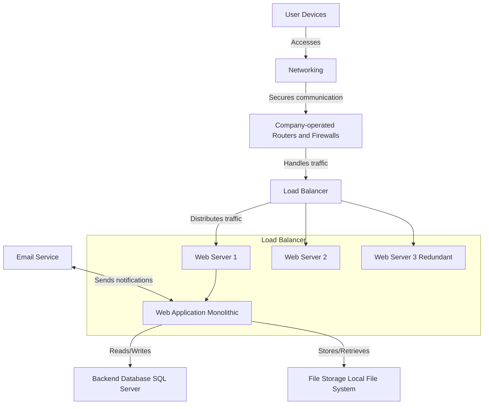
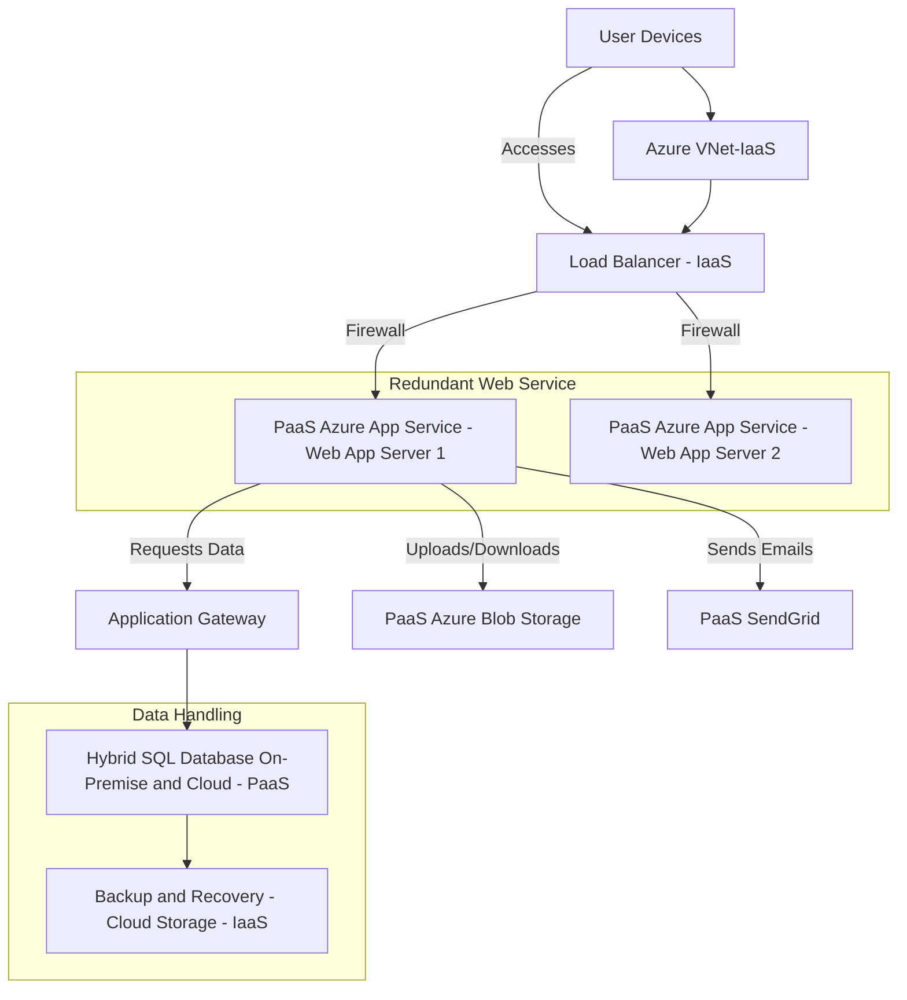

# LAB3

## Section 1: On-premise solution design

The diagram represents a typical on-premise infrastructure, where user devices connect to the network through secure communication managed by networking components, such as routers and firewalls operated by the company. These components handle incoming and outgoing traffic, directing it towards a load balancer. The load balancer ensures the traffic is distributed efficiently across three web servers, one of which serves as a redundant backup to ensure reliability. The web servers work together to deliver a web application that interacts with a backend SQL server database, facilitating the storage and retrieval of data. Additionally, the infrastructure includes a local file storage system responsible for managing and storing files. The web application is also integrated with an email service, allowing it to send notifications to users as needed. This architecture demonstrates how traffic moves through each layer of the system and how different components like the load balancer, web servers, database, and storage interact to provide a complete, functioning on-premise solution. 

### Key components need to be migrated

The scalability, security, and maintenance ease of the new cloud-based system will be much enhanced .The present networking and security configuration will be moved to a Virtual Private Cloud . Here, we can manage traffic safely without all the hardware trouble by using Security Groups and firewall services like AWS WA. In lieu of your present load balancer, which controls traffic to your web servers, a cloud-native load balancer such as AWS Elastic Load Balancer will be installed. It will automatically grow to accommodate surges in traffic and ensure that your services remain available even during periods of high demand.The application will be moved to virtual machines  

## Section 2: Migration strategies

Here’s a proposed migration strategy for each component of your on-premise architecture, incorporating the outlined migration plan while ensuring a smooth transition to the cloud.

### Proposed Migration Strategy

**1. Networking and Security** 
The current network configurations and the security policies in place will be closely studied for replication and improvement during the migration in the cloud. The setup will include a Virtual Private Cloud , which will be set up accordingly for a secure environment suitable for operations. It will also include the management of traffic flow, which will be effectively carried out through Security Groups and Network Access Control Lists . Besides that better security will be implemented through managed firewall services like AWS WAF or Azure Firewall, hence meeting the requirements of the industry. Before going live, thorough testing will be performed to ensure all networking rules and security measures are working as expected.

**2. Load Balancer**
The following section will discuss the on-premise load balancer in use that distributes traffic across web servers. The migration plan should involve the selection of a cloud-native load balancing service, such as **AWS Elastic Load Balancer (ELB)** or Azure Load Balancer. Configuration involves comprehension of all rules and behavior presently handled by the load balancer to dynamically distribute incoming traffic according to real-world demand for access to resources. Testing under various traffic scenarios will confirm optimal performance and seamless failover capabilities.

**3. Web Servers**
The migration strategy for the web servers in this case, which are physical machines running applications, will involve provisioning VMs; it will either use AWS EC2 or Azure Virtual Machines depending on application needs. Further, to increase the level of efficiency, one may want to consider containerizing the application using Docker and then deploying it either on AWS ECS or on Azure Kubernetes Service. The migration process would involve the transfer of application data and configurations from on-premise servers to the cloud. After migration is done, there should be an overall validation of the application's functionality and performance in the new cloud environment before finalizing everything.

**4. Web Application Monolithic** 
Migrating the monolithic web application to a managed cloud service is required, for example, AWS Elastic Beanstalk or Azure App Service. During this phase, the possibility of refactoring the application to microservices to achieve more scalable and maintainable systems will be considered. Where feasible, attention should be given to starting refactoring in areas that will be high-impact. Ensuring seamless integration with the new backend database and storage solutions will be key. Full testing will be done for the performance of the application within the cloud, including load and stress testing.

**5. SQL Server for the Backend Database**
In the case of a backend database SQL Server, first of all an appropriate managed database service will be selected for migration, such as Amazon RDS or Azure SQL Database. The employment of tools such as AWS Database Migration Service or Azure Database Migration Service will take place to transfer data safely and efficiently into the new environment. The database settings will also be reviewed and fine-tuned further for better performance in the cloud context. Testing would, of course, be needed to confirm data integrity and applications were able to connect to the new structure of the database correctly.

**6. File Storage (Local File System)**
Local file storage will migrate to cloud object storage solutions, such as AWS S3 or Azure Blob Storage. The process will include the migration of files, keeping folder structures and permissions by using respective cloud storage migration tools or scripts. Controls for access and permission within the cloud storage solution should be configured in a way that emulates current access levels. Verification postmigration will involve application access to the new storage system and interaction with it.

**7. Email Service** 
The email service will migrate from on-premise, used to send notifications onto a managed service like **AWS Simple Email Service (SES)** or **SendGrid**. This will involve setting up of the email service with necessary configurations like verification of domains, DNS settings, and API integrations with applications. If some history or specific settings related to the emails exist, then those will also be accounted for in this migration process. After all, email functionality will be deeply tested, enabling it to present reliable delivery of notifications and proper integration with an application.

### Conclusion
This migration strategy aims to ensure a smooth transition from your on-premise architecture to a cloud-based setup. By following these steps for each component, you’ll be able to leverage the benefits of cloud computing while minimizing disruptions to your operations. Each migration phase should include careful planning, thorough testing, and appropriate fallback strategies to address any challenges that may arise during the transition.

migration plan

### Cloud Migration Strategy Proposal

**Overview:** This proposal aims at the migration of the existing architecture to a cloud-based environment using Azure services that are scalable, performance-oriented, and secure.

**1. User Devices**
User devices currently access the system seamlessly via the internet. Thankfully, there is no direct migration required for the user devices as they will continue getting cloud services without any changes required at their end.

**2. Load Balancer (IaaS)**
The on-premise load balancer, which distributes the traffic, will move either to **Azure Load Balancer** or **Azure Application Gateway**. The aim of migration is to perform efficient management of incoming traffic between web app servers with built-in redundancy. Appropriate routing rules and security policies will be attached to the load balancer for secure and efficient traffic management. Performance tests will be performed in order to verify the configuration of the load balancer in various traffic scenarios.

**3. Web App Servers - PaaS Azure App Service** 

The web app servers will be on the latest codebase and will be correctly scaled to meet demands. For ease of updates, **Continuous Integration/Continuous Deployment CI/CD** pipes will be set up using Azure DevOps so that deployments are glitch-free. Application testing will be thoroughly carried out on both web servers to ascertain functionality and performance.

**4. Application Gateway** 

The already set-up Application Gateway will be kept in order to distribute the requests between web app servers and a database efficiently. Configuration may require reworking in order for configuration settings related to load balancing and SSL termination. Health monitoring will be enabled; it would make sure that the traffic is routed only to healthy instances. Tests on connectivity and performance will be done in order to ensure the application gateway handles the requests for data correctly.

**5. Hybrid SQL Database (PaaS)**

Current hybrid SQL database will move to **Azure SQL Database** or to a **Managed Instance**, depending on hybrid data access needs. **Azure Data Sync** will be used to sync the on-premise database to the cloud database during the migration. Tests will be performed to ensure data integrity-all data is correctly moved and applications can successfully access the database.

**6. Backup and Recovery (Cloud Storage - IaaS)** 

The current backup and recovery infrastructure will be based on **Azure Blob Storage** to manage data. The storage account will be configured with adequate redundancy and proper control of access; automated policies of backup will also be scheduled periodically for database and application data. The backup and recovery processes should be well-tested to ensure that valid data restoration can be carried out in the shortest time if required.

**7. Blob Storage (PaaS)**

The **Azure Blob Storage** to be used for file uploads and downloads will be optimized for performance. This shall include lifecycle management and tiered storage where appropriate. Appropriate access permissions will be set up for Blob Storage in order to secure it, and uploading and downloading of files will be tested from the web app servers to ensure it works as expected.

**8. SendGrid (PaaS)**

The implementation of **SendGrid** to send emails will be reviewed and configured with the required API keys and domain settings accordingly. Implement email templates in order for the communications to remain consistent. Ensure testing that it is reliable to send emails from both web app servers and the messages are appropriately formatted.

**9. Azure VNet (IaaS)**

Web servers, application gateways, and databases are communicating securely over the Azure Virtual Network. Subnets and network security groups will be created, which will govern traffic flow to further improve security throughout the network. Connectivity tests will be run to confirm that all of the components in the VNet are communicating appropriately.

### Conclusion

This migration strategy advocates leveraging the power of Azure's strong cloud services to enhance the current architecture. It has taken care in the migration of each component to develop a system that would be secure, efficient, and extendable for future growth. Extensive testing within each phase shall help reduce disruptions and ensure a seamless transition into the cloud.

## Migration plan

Migration Plan This plan for migration outlines a structured approach to migration to Azure in such a way that the impact of service disruption is minimized. It begins with a Preparation and Assessment phase, which shall take two weeks. The assessment will be done on the present infrastructure, the documentation of workflows, and the formation of a migration team. The Networking and Security setup will take another two weeks to configure the Azure Virtual Network-VNet, Security Groups, and NACLs. This will be followed by thorough testing of network configurations and setup for security: Azure Load Balancer and Application Gateway configuration. This will be followed by the three-week-long **Migration of Web App Servers**, during which the migration of the web app servers to Azure App Service, creation of Azure DevOps CI/CD pipelines, and proper functionality and performance testing is performed. Next in line is one week of **Application Gateway Configuration** aimed at updating and configuring Application Gateway for load balancing, health monitoring, and connectivity testing.

The **Database Migration**, in turn, takes three weeks to move the hybrid SQL database onto Azure SQL Database. Azure Data Sync will be performed in this regard to ensure that data synchronization and integrity are ensured upon migration. Subsequently, the **Configuration of Backup and Recovery** will take one week to set up Azure Blob Storage for backup purposes. In this case, automated policies for backups and testing will ensure that restoration of data is efficiently performed.

This will be followed by the **Blob Storage Enhancement** phase, which will take one week, to optimize Azure Blob Storage configuration and test file functionalities. The **Email Service Migration** phase will ensure that SendGrid is set up correctly for integration with emails and tested to deliver reliably over the course of one week.
The phase of **Final Testing and Go-Live**, lasting two weeks, involves thorough testing of the migrated components for any post-migration issues not envisioned and going live. Finally, there shall be **Post-Migration Support** with continuous user support and system monitoring to effect all improvements that may be necessary. Overall, this migration plan is intended to provide a secure, efficient, and scalable cloud environment for the organization's current and future needs.

## Conclusion

In conclusion, this migration plan provides a well-structured and thoughtful approach to moving to Azure while minimizing service disruptions. With a clear timeline and focused phases, it ensures that each component—networking, security, web servers, databases, storage, and email services is smoothly transitioned and thoroughly tested. By starting with a detailed assessment and preparation phase, and continuing with careful testing and post-migration support, the plan prioritizes both the integrity of your data and the performance of your applications. Ultimately, the goal is to create a cloud environment that is not only secure and efficient but also scalable, capable of supporting the organization's growth and evolving needs well into the future.

